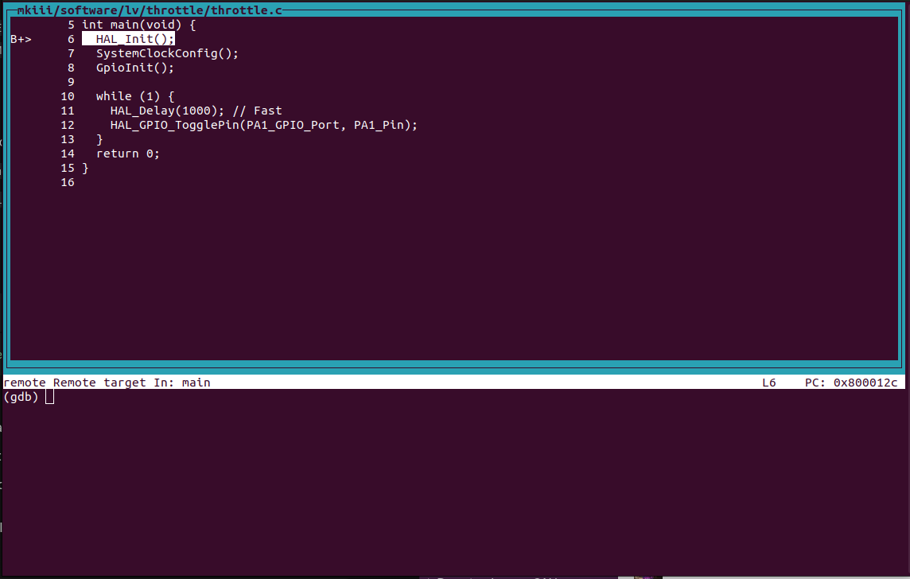

# bazel_stm32

This repository contains a hermetic Bazel build configuration for STM32 microcontrollers (specifically targeting the STM32G4 series). It handles toolchain management, HAL dependencies, and provides convenient commands for building, flashing, and debugging firmware.

## Prerequisites
Download the following
   - [Bazel](https://bazel.build/install) (Bazelisk is recommended but not needed)
   - OpenOCD: 
for Ubuntu/Linux:
```Shell
sudo apt install openocd
```

## Building the Firmware

#### To build:
 specific targets, you can use:

```Shell
bazel build --config=m4 //mkiii/software/lv/throttle:throttle.elf
```
This creates the .elf file inside the `bazel-bin` directory.

#### To flash:
specific target using ST-Link run:
```Shell
bazel run --config=m4 //mkiii/software/lv/throttle:throttle_flash
```

#### To debug:
using OpenOCD's debugging tool run:
```Shell
bazel run -c dbg --config=m4 //mkiii/software/lv/throttle:throttle_debug
```

## Basic debugging with OpenOCD

OpenOCD and GDB are the primary tools and can be used together for debugging STM32 applications. OpenOCD provides the interface to the hardware, while GDB is used to inspect and control the execution of the program.

The debug screen should look like this:



After the debug session is started, you can use GDB commands to control the execution of your program, set breakpoints, and inspect variables.

Here are some common GDB commands:

- `break <function>` or `b <function>`: Set a breakpoint at the specified function.
- `continue` or `c`: Resume program execution until the next breakpoint.
- `next` or `n`: Execute the next line of code, stepping over functions.
- `step` or `s`: Execute the next line of code, stepping into functions.
- `finish` or `fin`: Continue execution until the current function returns.
- `print <variable>`: Print the value of the specified variable.
- `display <var>`: Automatically display the value of a variable each time the program stops.
- `undisplay <id_number>`: Stop displaying the value of a variable.
- `p/x <variable>`: Print the value of a variable in hexadecimal format.
- `info locals`: Print the values of all local variables in the current stack frame.
- `set <var> <variable_name> = <value>`: force the value of a variable.

If you want to detach from the chip and leave the OpenOCD session, you can use the `detach` command in GDB. Then type `exit` to close the GDB session.
